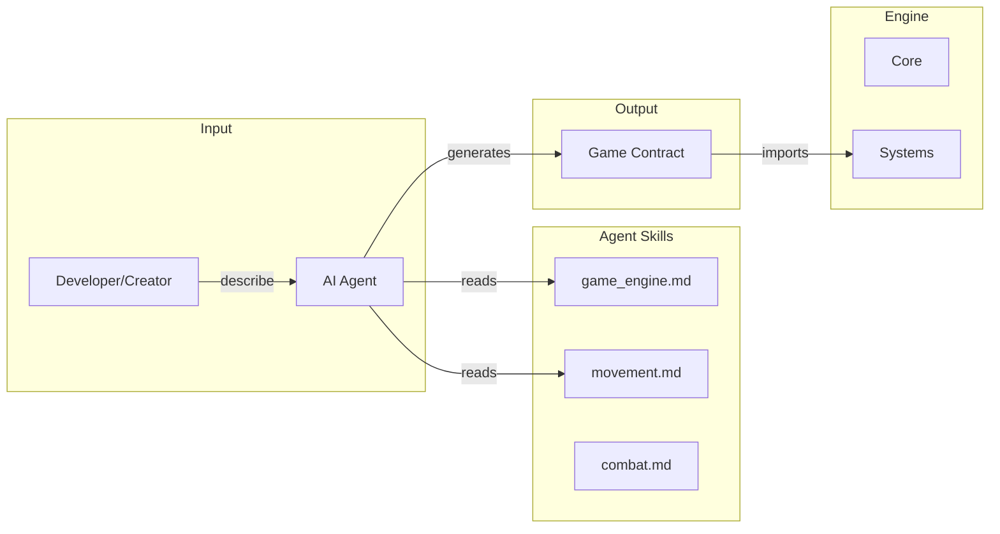
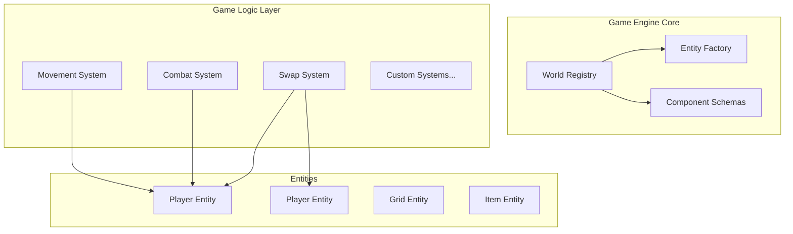
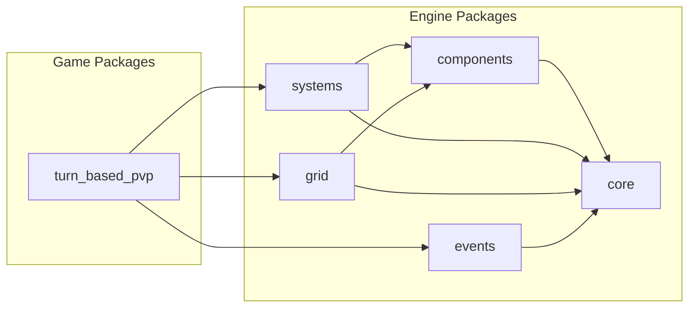
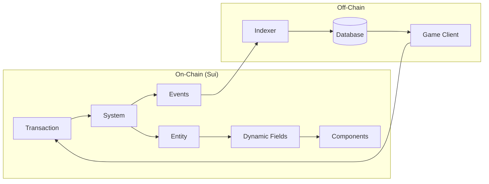
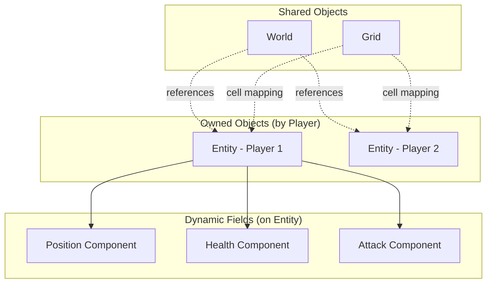
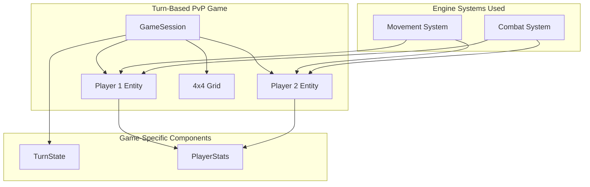
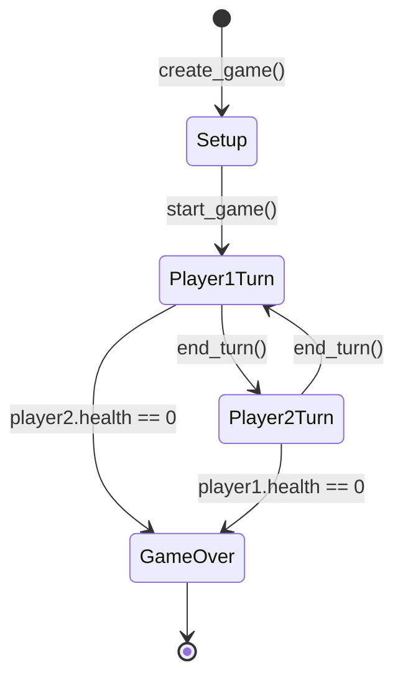
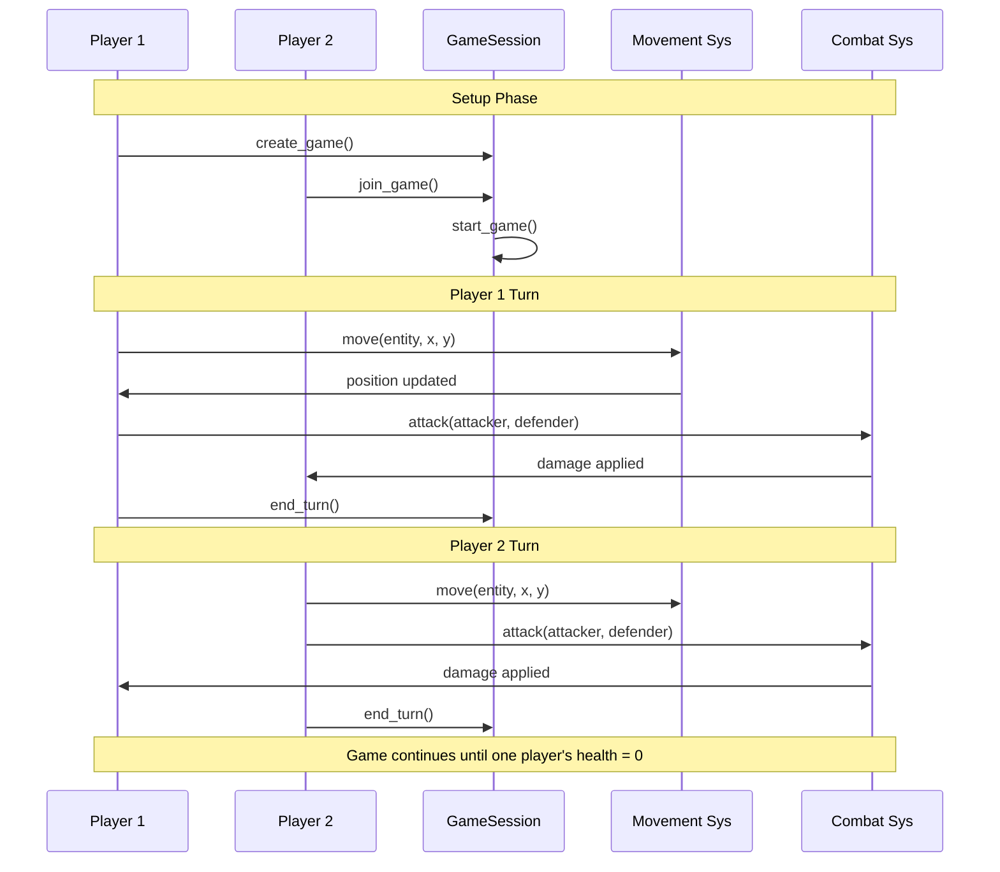
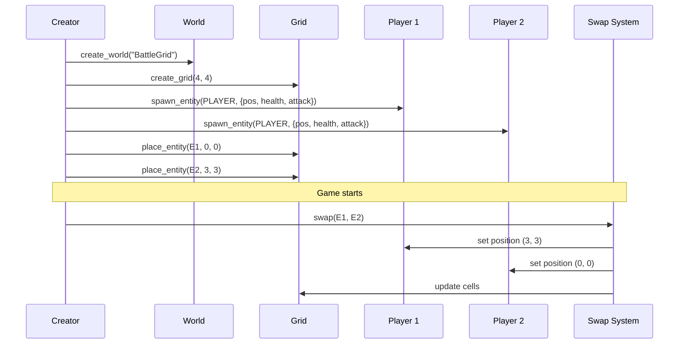

# Sui On-Chain Game Engine - Architecture Proposal

## Vision

A **fully on-chain ECS game engine** on Sui that enables creators and AI agents to build games in minutes. The engine manages state, handles game logic, and provides composable primitives.

---

## Developer Experience: Build Games in Minutes

### Game Creation Flow with AI

```
┌─────────────────────────────────────────────────────────────────┐
│  Step 1: DESCRIBE     │  Step 2: AI READS    │  Step 3: DEPLOY  │
│  YOUR GAME            │  AGENT SKILLS        │  & PLAY          │
├───────────────────────┼──────────────────────┼──────────────────┤
│  "I want a 4x4 grid   │  • game_engine.md    │  sui publish     │
│   battle game..."     │  • movement.md       │  Game live!      │
│                       │  • combat.md         │                  │
└───────────────────────┴──────────────────────┴──────────────────┘
```

### Flow Diagram



### Example: AI Conversation

```
USER: Create a tic-tac-toe game on the engine

AI: Creating tic-tac-toe...
    
    Reading skills: ✓ game_engine.md ✓ grid.md
    
    Game Structure:
    • 3x3 Grid
    • 2 Players (X and O)  
    • Place marker action
    • Win condition check
    
    [Generates tic_tac_toe.move]
    
    Deploy: sui client publish
```

### Value Proposition

| Aspect | Traditional | With Engine + AI |
|--------|-------------|------------------|
| Learn Move | Weeks | AI handles it |
| Design | Days | Pre-designed |
| Write logic | Days | Minutes |
| Deploy | Complex | One command |

---

## Goals (Phase 1)

- ✅ Core ECS primitives (Entity, Component, System)
- ✅ Component bitmask for O(1) existence checks
- ✅ Standard components (Position, Health, Attack, Movement, Identity)
- ✅ Grid-based game support
- ✅ Basic systems (Movement, Combat, Swap, Spawn)
- ✅ Event emission for off-chain indexing
- ✅ **Multi-World support** (deploy once, anyone can create worlds)
- ✅ **Agent Skills** (documentation for AI agents to use the engine)
- ✅ Simple 4x4 grid game example

---

## Non-Goals (Phase 1)

- ❌ Authorization/Capabilities (deferred to Phase 2)
- ❌ Off-chain indexer implementation
- ❌ Client SDK / Frontend
- ❌ Tick-based automatic execution
- ❌ Complex game templates (RPG, Strategy, etc.)

---

## Phase 2 Roadmap

| Feature | Description |
|---------|-------------|
| **Entity Ownership** | Add `owner: address` field to Entity for access control |
| **System Registry** | Register/unregister systems in World |
| **World Pause** | Admin can pause/resume game |
| **Query System** | Find entities by component combination |
| **Indexer** | Off-chain event indexer for state sync |
| **AI Action API** | Simplified `execute_action()` for AI agents |
| **Game Templates** | Pre-built templates (RPG, Strategy, etc.) |
| **Visual Animation** | Client-side animation system for game actions |

### Phase 2: Entity Ownership (Preview)

```move
public struct Entity has key {
    id: UID,
    owner: address,       // Phase 2: Who owns this entity
    world_id: ID,
    entity_type: u8,
    component_mask: u256,
    created_at: u64,
}

// Player actions require owner check
public fun move_entity(entity: &mut Entity, new_x: u64, ctx: &TxContext) {
    assert!(entity.owner == tx_context::sender(ctx), ENotOwner);
    // ... modify position
}

// Game mechanics (damage, effects) can skip owner check
public fun apply_damage(entity: &mut Entity, damage: u64) {
    // No owner check - any system can apply damage
}
```

---

## Core Design Principles

| Principle | Description |
|-----------|-------------|
| **Sui-Native** | Leverage Sui's object model, not fight against it |
| **Composable** | Mix and match components; extend without modifying |
| **AI-Friendly** | Simple, predictable APIs that AI agents can invoke |
| **Gas-Efficient** | Minimize storage and computation costs |
| **Upgradeable** | Version components and systems cleanly |

---

## Prerequisites

| Requirement | Version | Purpose |
|------------|---------|---------|
| **Sui CLI** | >= 1.0 | Build, test, and deploy Move packages |
| **Move Language** | Sui Move | Smart contract development |
| **Git** | Any | Version control |

**Knowledge Requirements:**
- Sui object model (owned vs shared objects)
- Move language basics (structs, abilities, generics)
- Dynamic fields concept

---

## Tech Stack

| Layer | Technology | Description |
|-------|------------|-------------|
| **Blockchain** | Sui Network | Layer 1 with object-centric model |
| **Language** | Move | Smart contract language |
| **Storage** | Dynamic Fields | Component attachment to entities |
| **Data Types** | `Table`, `VecMap` | Efficient on-chain collections |
| **Events** | Sui Events | Off-chain indexing & client sync |
| **Testing** | Move Unit Tests | On-chain logic verification |

---

## High-Level Architecture



---

## Detailed Architecture

### Package Dependency Graph



### Data Flow Architecture



### Object Ownership Model



---

## Example: Turn-Based PvP Game

A complete example of a **2-player turn-based combat game** built on the engine.

### Game Architecture



### Game State Machine



### Game-Specific Structs

```move
/// Game session - shared object managing the match
public struct GameSession has key {
    id: UID,
    world_id: ID,
    player1: ID,           // Entity ID
    player2: ID,           // Entity ID
    current_turn: u8,      // 0 = player1, 1 = player2
    turn_number: u64,
    state: u8,             // 0=setup, 1=active, 2=finished
    winner: Option<ID>,
}

/// Turn state component added to players
public struct TurnState has store, copy, drop {
    actions_remaining: u8,  // Actions per turn (move, attack)
    last_action_time: u64,
}
```

### Game Flow (Sequence Diagram)



### Game Entry Points

```move
module game::turn_based_pvp;

use engine::world;
use engine::entity;
use engine::movement_sys;
use engine::combat_sys;
use engine::grid;

/// Create a new game session
public fun create_game(
    world: &World,
    player1_entity: &mut Entity,
    grid: &mut Grid,
    ctx: &mut TxContext,
): GameSession {
    // Place player1 at (0, 0)
    grid::place_entity(grid, player1_entity, 0, 0);
    
    GameSession {
        id: object::new(ctx),
        world_id: object::id(world),
        player1: object::id(player1_entity),
        player2: option::none(),
        current_turn: 0,
        turn_number: 0,
        state: 0,  // Setup
        winner: option::none(),
    }
}

/// Player 2 joins the game
public fun join_game(
    session: &mut GameSession,
    player2_entity: &mut Entity,
    grid: &mut Grid,
) {
    assert!(session.state == 0, EGameAlreadyStarted);
    
    // Place player2 at (3, 3)
    grid::place_entity(grid, player2_entity, 3, 3);
    session.player2 = object::id(player2_entity);
    session.state = 1;  // Active
}

/// Player moves their entity (costs 1 action)
public fun player_move(
    session: &mut GameSession,
    entity: &mut Entity,
    new_x: u64,
    new_y: u64,
    grid: &Grid,
    ctx: &TxContext,
) {
    assert_is_current_player(session, entity, ctx);
    assert_has_actions(entity);
    
    movement_sys::move_to(entity, new_x, new_y, grid);
    decrement_actions(entity);
}

/// Player attacks opponent (costs 1 action)
public fun player_attack(
    session: &mut GameSession,
    attacker: &mut Entity,
    defender: &mut Entity,
    clock: &Clock,
    ctx: &TxContext,
) {
    assert_is_current_player(session, attacker, ctx);
    assert_has_actions(attacker);
    
    combat_sys::attack(attacker, defender, clock);
    decrement_actions(attacker);
    
    // Check for game over
    if (is_dead(defender)) {
        session.state = 2;  // Finished
        session.winner = option::some(object::id(attacker));
    };
}

/// End current player's turn
public fun end_turn(session: &mut GameSession, ctx: &TxContext) {
    session.current_turn = (session.current_turn + 1) % 2;
    session.turn_number = session.turn_number + 1;
    // Reset actions for next player
}
```

---

## System Access for Game Devs

Game developers have **two options** to use systems:

### Option A: Import Systems Directly (Power Users)

```move
use engine::world;
use engine::movement_sys;
use engine::combat_sys;

public fun player_move(entity: &mut Entity, x: u64, y: u64) {
    movement_sys::move_to(entity, x, y);
}
```

### Option B: Use World Wrapper Functions (Simple)

```move
use engine::world;  // Only need to import world

public fun player_move(world: &World, entity: &mut Entity, x: u64, y: u64) {
    world::move_entity(entity, x, y);  // Wrapper calls movement_sys internally
}
```

The World module re-exports all standard systems via wrapper functions for convenience.

---

## Core Abstractions

### 1. World (Shared Object)

The **World** is the central registry that tracks all game state and configuration.

```move
/// The game world - central registry
public struct World has key {
    id: UID,
    name: String,
    version: u64,
    
    // Configuration
    config: WorldConfig,
    
    // Registries (as dynamic fields)
    // - "entities": Table<ID, EntityMeta>
    // - "systems": Table<String, SystemMeta>
    // - "component_schemas": Table<String, ComponentSchema>
}

public struct WorldConfig has store {
    paused: bool,
    max_entities: u64,
    tick_rate_ms: u64,  // For time-based systems
}
```

**Why a World?**
- Single entry point for game state queries
- Consistent access control
- Enables game-wide pause/resume
- Tracks all registered systems

---

### 2. Entity

Entities are **Sui objects** that hold components via dynamic fields.

```move
/// A game entity - can be player, NPC, item, tile, etc.
public struct Entity has key, store {
    id: UID,
    world_id: ID,           // Which world this belongs to
    entity_type: u8,        // Type enum for quick filtering
    created_at: u64,
    
    // Component mask (bitfield) for O(1) component checks
    component_mask: u256,
}

/// Entity types
const ENTITY_TYPE_PLAYER: u8 = 0;
const ENTITY_TYPE_NPC: u8 = 1;
const ENTITY_TYPE_ITEM: u8 = 2;
const ENTITY_TYPE_TILE: u8 = 3;
const ENTITY_TYPE_GRID: u8 = 4;
```

**Key Design Decisions:**

| Decision | Rationale |
|----------|-----------|
| `component_mask: u256` | Allows checking "has component X?" in O(1) without dynamic field lookup |
| `world_id: ID` | Links entity to its world for validation |
| `entity_type: u8` | Fast type filtering without parsing |

---

### 3. Components

Components are **pure data structs** attached to entities.

```move
/// Position in a 2D grid
public struct Position has store, copy, drop {
    x: u64,
    y: u64,
}

/// Health points
public struct Health has store, copy, drop {
    current: u64,
    max: u64,
}

/// Attack capability
public struct Attack has store, copy, drop {
    damage: u64,
    range: u8,
    cooldown_ms: u64,
}

/// Identity/ownership
public struct Identity has store, drop {
    name: String,
    owner: address,
    image_url: Option<Url>,
}

/// Movement capability
public struct Movement has store, copy, drop {
    speed: u8,
    movement_type: u8,  // 0=walk, 1=fly, 2=teleport
}
```

**Component Bits (for mask):**
```move
const COMPONENT_POSITION: u256 = 1;      // bit 0
const COMPONENT_HEALTH: u256 = 2;        // bit 1
const COMPONENT_ATTACK: u256 = 4;        // bit 2
const COMPONENT_IDENTITY: u256 = 8;      // bit 3
const COMPONENT_MOVEMENT: u256 = 16;     // bit 4
// ... up to 256 component types
```

---

### 4. Component Operations

```move
/// Add a component to an entity
public fun add_component<T: store>(
    entity: &mut Entity,
    component_bit: u256,
    key: vector<u8>,
    value: T,
) {
    // Update mask
    entity.component_mask = entity.component_mask | component_bit;
    // Store component
    dynamic_field::add(&mut entity.id, key, value);
}

/// Check if entity has component (O(1))
public fun has_component(entity: &Entity, component_bit: u256): bool {
    (entity.component_mask & component_bit) != 0
}

/// Borrow component for reading
public fun borrow<T: store>(entity: &Entity, key: vector<u8>): &T {
    dynamic_field::borrow(&entity.id, key)
}

/// Borrow component for modification
public fun borrow_mut<T: store>(
    entity: &mut Entity, 
    key: vector<u8>
): &mut T {
    dynamic_field::borrow_mut(&mut entity.id, key)
}
```

---

### 5. Systems

Systems are **stateless modules** that operate on entities with specific components.

```move
/// System metadata (registered in World)
public struct SystemMeta has store {
    name: String,
    version: u64,
    required_components: u256,  // Bitmask of required components
    enabled: bool,
}
```

#### Movement System Example

```move
module engine::movement_system;

use engine::entity::{Entity, has_component, borrow_mut};
use engine::components::{Position, Movement, COMPONENT_POSITION, COMPONENT_MOVEMENT};

const ENotMovable: u64 = 1;
const EInvalidPosition: u64 = 2;

/// Move entity to new position
public fun move_to(
    entity: &mut Entity,
    new_x: u64,
    new_y: u64,
    grid: &Grid,
) {
    // Require Position + Movement components
    assert!(
        has_component(entity, COMPONENT_POSITION | COMPONENT_MOVEMENT),
        ENotMovable
    );
    
    // Validate position is within grid bounds
    assert!(grid.is_valid_position(new_x, new_y), EInvalidPosition);
    
    // Update position
    let pos = borrow_mut<Position>(entity, b"position");
    pos.x = new_x;
    pos.y = new_y;
}
```

#### Swap System Example

```move
module engine::swap_system;

use engine::entity::{Entity, borrow_mut};
use engine::components::{Position, COMPONENT_POSITION};

/// Swap positions of two entities
public fun swap(
    entity1: &mut Entity,
    entity2: &mut Entity,
) {
    // Get current positions
    let pos1 = borrow_mut<Position>(entity1, b"position");
    let pos2 = borrow_mut<Position>(entity2, b"position");
    
    // Swap
    let temp_x = pos1.x;
    let temp_y = pos1.y;
    
    pos1.x = pos2.x;
    pos1.y = pos2.y;
    
    pos2.x = temp_x;
    pos2.y = temp_y;
}
```

#### Combat System Example

```move
module engine::combat_system;

use engine::entity::{Entity, has_component, borrow, borrow_mut};
use engine::components::{Health, Attack, Position, COMPONENT_HEALTH, COMPONENT_ATTACK, COMPONENT_POSITION};
use engine::events;

const ECantAttack: u64 = 1;
const EOutOfRange: u64 = 2;

/// Attack another entity
public fun attack(
    attacker: &mut Entity,
    defender: &mut Entity,
    clock: &Clock,
) {
    // Validate attacker has Attack component
    assert!(has_component(attacker, COMPONENT_ATTACK), ECantAttack);
    // Validate defender has Health component
    assert!(has_component(defender, COMPONENT_HEALTH), ECantAttack);
    
    // Check range
    let attacker_pos = borrow<Position>(attacker, b"position");
    let defender_pos = borrow<Position>(defender, b"position");
    let attack_stats = borrow<Attack>(attacker, b"attack");
    
    let distance = calculate_distance(attacker_pos, defender_pos);
    assert!(distance <= (attack_stats.range as u64), EOutOfRange);
    
    // Apply damage
    let defender_health = borrow_mut<Health>(defender, b"health");
    let damage = attack_stats.damage;
    
    if (defender_health.current > damage) {
        defender_health.current = defender_health.current - damage;
    } else {
        defender_health.current = 0;
    };
    
    // Emit event
    events::emit_attack(
        object::id(attacker),
        object::id(defender),
        damage,
        defender_health.current,
        clock.timestamp_ms(),
    );
}
```

---

> [!NOTE]
> **Phase 2: Authorization Model**
> 
> Capabilities (AdminCap, SystemCap, PlayerCap) will be added in Phase 2 to control:
> - Who can modify components
> - Who can invoke systems
> - World pause/resume
> - System registration

---

## Grid System (For Your 4x4 Example)

```move
/// A game grid - shared object
public struct Grid has key {
    id: UID,
    world_id: ID,
    width: u8,
    height: u8,
    // Cell -> Entity ID mapping
    cells: Table<CellKey, Option<ID>>,
}

public struct CellKey has copy, drop, store {
    x: u8,
    y: u8,
}

/// Place entity on grid
public fun place_entity(
    grid: &mut Grid,
    entity: &mut Entity,
    x: u8,
    y: u8,
) {
    let key = CellKey { x, y };
    assert!(!table::contains(&grid.cells, key) || 
            option::is_none(table::borrow(&grid.cells, key)), EPositionOccupied);
    
    // Update grid
    if (table::contains(&grid.cells, key)) {
        *table::borrow_mut(&mut grid.cells, key) = option::some(object::id(entity));
    } else {
        table::add(&mut grid.cells, key, option::some(object::id(entity)));
    };
    
    // Update entity position component
    let pos = borrow_mut<Position>(entity, b"position");
    pos.x = (x as u64);
    pos.y = (y as u64);
}
```

---

## Event System

Events enable off-chain indexing and client synchronization.

```move
/// Base event for all game actions
public struct GameEvent has copy, drop {
    world_id: ID,
    event_type: u8,
    timestamp: u64,
}

public struct AttackEvent has copy, drop {
    attacker_id: ID,
    defender_id: ID,
    damage: u64,
    defender_remaining_health: u64,
    timestamp: u64,
}

public struct MoveEvent has copy, drop {
    entity_id: ID,
    from_x: u64,
    from_y: u64,
    to_x: u64,
    to_y: u64,
    timestamp: u64,
}

public struct SwapEvent has copy, drop {
    entity1_id: ID,
    entity2_id: ID,
    timestamp: u64,
}
```

---

## Package Structure

```
game-engine/
├── packages/
│   ├── core/                    # Core engine primitives
│   │   ├── sources/
│   │   │   ├── world.move       # World registry
│   │   │   ├── entity.move      # Entity struct + operations
│   │   │   └── component.move   # Component helpers
│   │   └── Move.toml
│   │
│   ├── components/              # Standard components
│   │   ├── sources/
│   │   │   ├── position.move
│   │   │   ├── health.move
│   │   │   ├── attack.move
│   │   │   ├── movement.move
│   │   │   └── identity.move
│   │   └── Move.toml
│   │
│   ├── systems/                 # Standard systems
│   │   ├── sources/
│   │   │   ├── movement_sys.move
│   │   │   ├── combat_sys.move
│   │   │   ├── swap_sys.move
│   │   │   └── spawn_sys.move
│   │   └── Move.toml
│   │
│   ├── grid/                    # Grid-based game support
│   │   ├── sources/
│   │   │   ├── grid.move
│   │   │   └── grid_helpers.move
│   │   └── Move.toml
│   │
│   └── events/                  # Event definitions
│       ├── sources/
│       │   └── events.move
│       └── Move.toml
│
│   # Phase 2 additions:
│   # └── auth/                  # Capability definitions
```

---

## Example: 4x4 Grid Game Flow



---

## Design Decisions Summary

| Decision | Choice | Rationale |
|----------|--------|-----------|
| Entity storage | Owned objects with dynamic fields | Sui-native, gas efficient |
| Component lookup | Bitmask + dynamic fields | O(1) has-check, flexible storage |
| World | Single shared object | Central state, pause control |
| Grid | Separate shared object | Can have multiple grids per world |
| Systems | Stateless modules | Composable, upgradeable |
| Authorization | **Phase 2** | Deferred to simplify initial implementation |

---

## Scalability

### Adding New Components

```move
// Just define a new struct + assign a bit
const COMPONENT_INVENTORY: u256 = 1 << 5;

public struct Inventory has store {
    items: vector<ID>,
    capacity: u64,
}
```

- ✅ No entity changes required
- ✅ Up to 256 component types (u256 bitmask)
- ✅ Dynamic fields handle storage automatically

### Adding New Systems

```move
// Just create a new module
module engine::inventory_sys;

public fun add_item(entity: &mut Entity, item_id: ID) {
    // Works with existing entity structure
}
```

- ✅ Systems are independent modules
- ✅ No core engine changes needed
- ✅ New systems can compose existing ones

---

## Sample Games (Buildable with Phase 1)

### Grid-Based Games

| Game | Description | Components Used |
|------|-------------|-----------------|
| **Tic-Tac-Toe** | 3x3 grid, place markers | Position, Identity |
| **Chess** | 8x8 grid, piece movement | Position, Movement, Identity |
| **Checkers** | 8x8 grid, capture mechanics | Position, Movement, Health |
| **Match-3 Puzzle** | 4x4+ grid, swap tiles | Position, Swap system |
| **Battleship** | Hidden grid, attack cells | Position, Health, Attack |

### Combat/Arena Games

| Game | Description | Components Used |
|------|-------------|-----------------|
| **Auto-Battler** | 2 teams fight automatically | Position, Health, Attack |
| **Turn-Based PvP** | Players take turns attacking | All components |
| **Monster Tamer** | Spawn creatures, battle | Health, Attack, Identity |

### Simple Strategy

| Game | Description | Components Used |
|------|-------------|-----------------|
| **Capture the Flag** | Move to capture point | Position, Movement |
| **King of the Hill** | Control center tile | Position, Health |
| **Territory Control** | Claim grid cells | Position, Identity |

---

## Open Questions for Discussion

1. **Entity Ownership**: Should entities be owned by players (transfer::transfer) or shared (transfer::share_object)?
   - Owned = only owner can pass to systems
   - Shared = anyone can interact (needs access control)

2. **System Registration**: Should systems be registered in World, or left open?
   - Registered = stricter control, easier tracking
   - Open = more composable, harder to manage

3. **Tick System**: Do we need time-based automatic execution, or is everything triggered by transactions?

4. **AI Agent Interface**: Should we have a simplified "action" pattern for AI agents?
   ```move
   public fun execute_action(world: &mut World, action: Action)
   ```

---

## Next Steps

After approval, I'll implement:
1. Core engine package with Entity + Component primitives
2. Standard components (Position, Health, Attack)
3. Grid system
4. Example swap/movement/combat systems
5. Simple 4x4 game demonstrating all features
