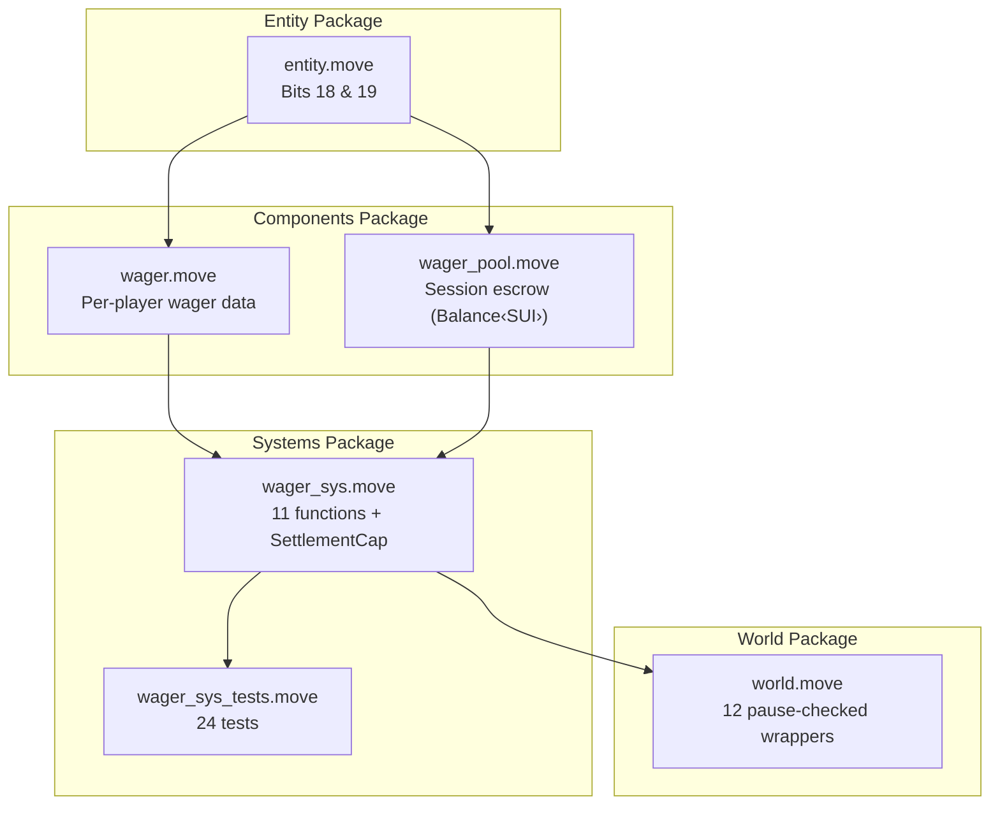
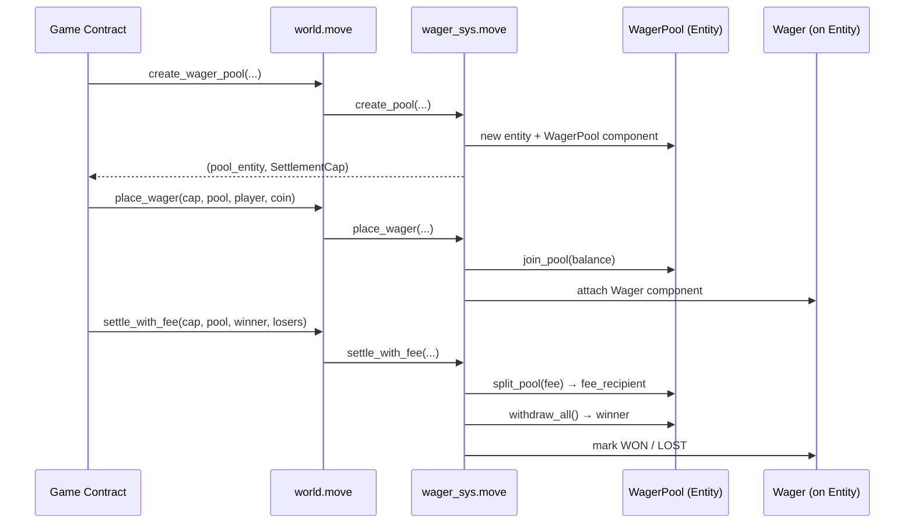

# Wagering System — Post-Implementation Walkthrough

## Overview

A complete on-chain wagering subsystem was added to the ECS game engine across **4 packages**, **10 files**, and **~1,800 lines of new code**. The system enables SUI-denominated wagers with escrow, settlement, refund, and timeout mechanics — all governed by a capability-based access pattern (`SettlementCap`).

---

## Architecture



### Data Flow



---

## Files Changed

| File | Lines | What |
|------|------:|------|
| `components/sources/wager.move` | 93 | Per-player wager component (amount, status, player) |
| `components/sources/wager_pool.move` | 147 | Session escrow with `Balance<SUI>` (no copy/drop) |
| `entity/sources/entity.move` | +4 | Bits 18 (Wager) and 19 (WagerPool) |
| `systems/sources/wager_sys.move` | 580 | 11 functions, SettlementCap, 4 events |
| `systems/tests/wager_sys_tests.move` | 830 | 24 test functions |
| `world/sources/world.move` | +160 | 12 wager wrappers + import |
| `engine-docs/entity.md` | +2 | Bitmask table |
| `engine-docs/components.md` | +34 | Wager + WagerPool API docs |
| `engine-docs/systems.md` | +30 | wager_sys #19 section |
| `engine-docs/world.md` | +18 | Wager wrappers section |

---

## Component Details

### Wager (per-player)

```move
public struct Wager has store, copy, drop {
    amount: u64,      // MIST
    status: u8,       // 0=PENDING, 1=LOCKED, 2=WON, 3=LOST, 4=REFUNDED
    player: address,
}
```

Attached to a **player entity** via bit 18. Tracks what each player wagered and their outcome.

### WagerPool (session escrow)

```move
public struct WagerPool has store {  // NO copy, NO drop
    pool: Balance<SUI>,
    wager_amount: u64,
    player_count: u8,
    max_players: u8,
    settled: bool,
    protocol_fee_bps: u16,
    fee_recipient: address,
    payout_mode: u8,
    created_at: u64,
    timeout_ms: u64,
}
```

Attached to a **pool entity** via bit 19. The `Balance<SUI>` prevents silent destruction — must be explicitly drained.

---

## System API — `wager_sys`

| Function | Cap? | Description |
|----------|:----:|-------------|
| `create_pool` | — | Creates pool entity + `SettlementCap` |
| `place_wager` | ✅ | Exact coin amount, merge into pool, attach Wager |
| `lock_wagers` | ✅ | PENDING → LOCKED for all players |
| `settle_winner` | ✅ | 100% to winner, no fee |
| `settle_with_fee` | ✅ | Fee → fee_recipient, remainder → winner |
| `settle_proportional` | ✅ | Split by share basis points (sum to 10000) |
| `settle_timeout` | ✅ | Auto-forfeit after clock expiry |
| `refund_all` | ✅ | Refund all PENDING/LOCKED (game cancelled) |
| `refund_player` | ✅ | Refund single PENDING wager |
| `destroy_empty_pool` | ✅ | Aborts if balance > 0 |
| `destroy_cap` | — | Free SettlementCap UID |

**Events:** `WagerPlacedEvent`, `WagerSettledEvent`, `WagerRefundedEvent`, `WagerLostEvent`

---

## Key Design Decisions

### 1. Capability-Based Access (`SettlementCap`)

```move
public struct SettlementCap has key, store {
    id: UID,
    pool_id: ID,  // bound to exactly one pool
}
```

Only the game contract holding the cap can settle or refund. One cap per pool — created at pool creation, destroyed after game ends.

### 2. Immutable-Then-Mutate Borrow Pattern

Move's borrow checker forbids overlapping `&` and `&mut` borrows. All settlement functions capture IDs and read immutably first, then do a single mutable borrow for mutations. This resolved **6 borrow conflicts**.

### 3. Inlined `settle_timeout`

Can't create `vector[&mut Entity]` in Move (references can't go in vectors). Instead of delegating to `settle_with_fee`, the timeout logic is inlined — handles both the winner and single loser directly.

### 4. `u128` Fee Calculation

```move
fun calc_fee(total: u64, fee_bps: u16): u64 {
    (((total as u128) * (fee_bps as u128) / 10000u128) as u64)
}
```

Prevents overflow for pools up to ~340 billion SUI.

### 5. `destroy_settlement_cap` Skips Pause Check

Freeing a capability is always safe — even when the world is paused.

---

## Test Coverage — `wager_sys_tests.move`

24 test functions covering all 11 public API functions plus error paths:

| Category | Tests | Type |
|----------|------:|------|
| Pool creation & cap binding | 2 | happy path |
| Place wager (valid, wrong amount, duplicate) | 3 | happy + 2 failure |
| Lock wagers (valid, already locked) | 2 | happy + 1 failure |
| Settle winner (no fee) | 2 | happy paths |
| Settle with fee | 1 | happy path |
| Settle already settled | 1 | failure |
| Wrong cap on settlement | 1 | failure |
| Timeout (expired, not expired, lobby not full) | 3 | happy + 2 failure |
| Loser status marking | 1 | happy path |
| Refund player / refund all | 2 | happy path |
| Refund locked player | 1 | failure |
| Destroy pool with balance | 1 | failure |
| Proportional split + invalid shares | 2 | happy + 1 failure |
| Pool full rejection | 1 | failure |
| Fee overflow (1B SUI) | 1 | happy path |

---

## Build Verification

```
✅ engine/entity     — clean
✅ engine/components — clean
✅ engine/systems    — clean
✅ engine/world      — clean
```

---

## Docs Updated

- **entity.md** — Bits 18 (Wager) and 19 (WagerPool) in bitmask table
- **components.md** — Wager + WagerPool sections with API tables
- **systems.md** — wager_sys #19 with function table, events, Wagering category (18→19 modules)
- **world.md** — 12 wager wrappers listed
